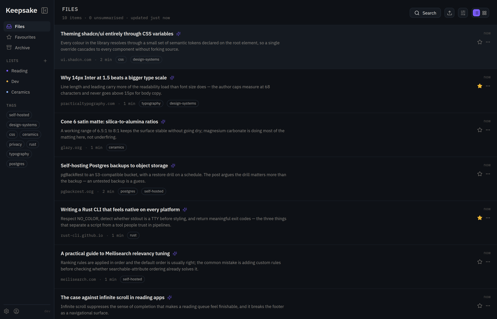
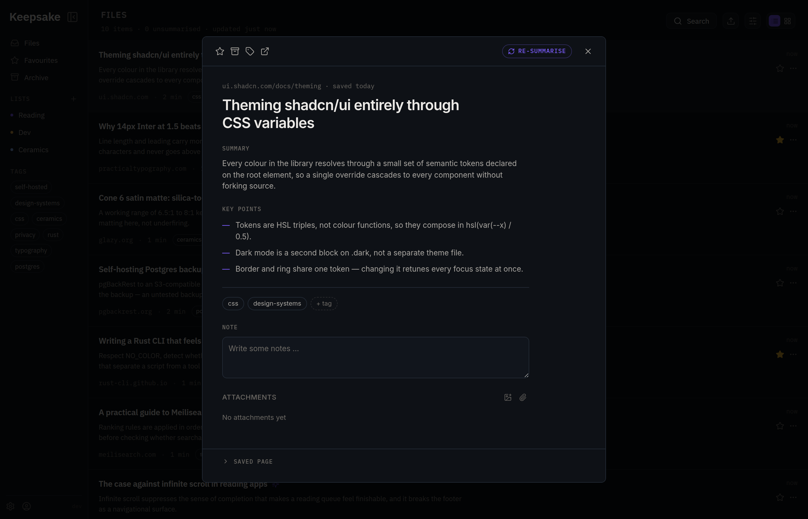
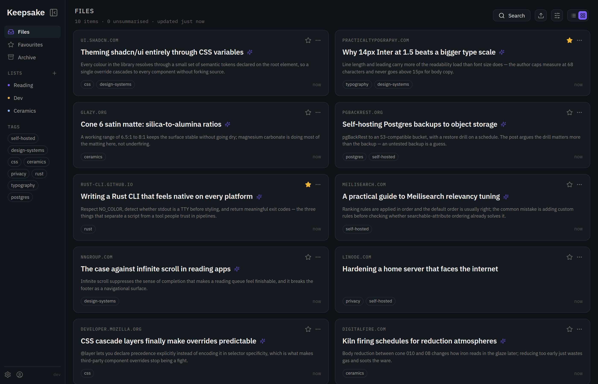
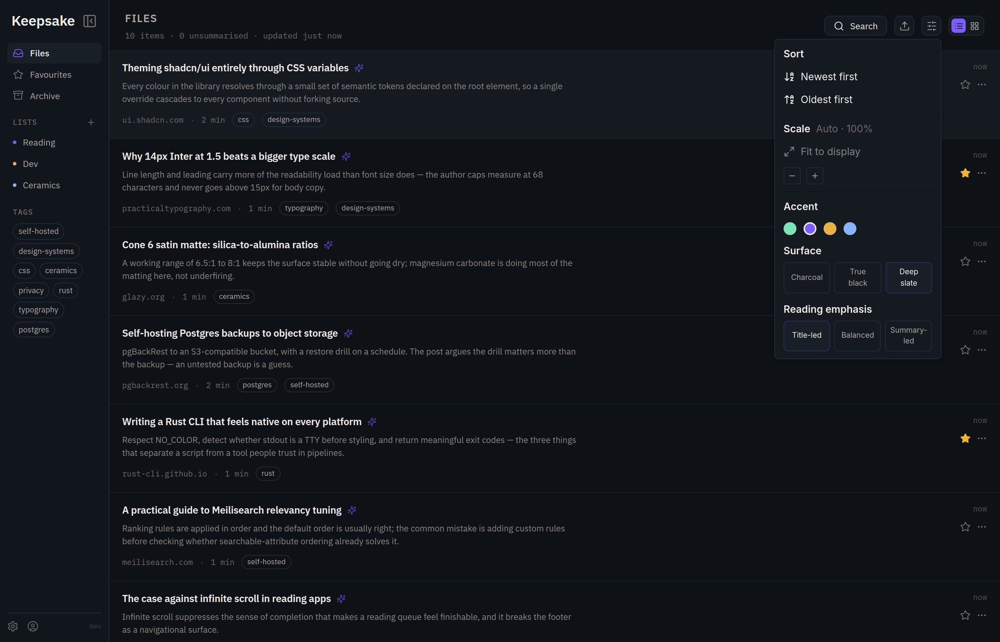
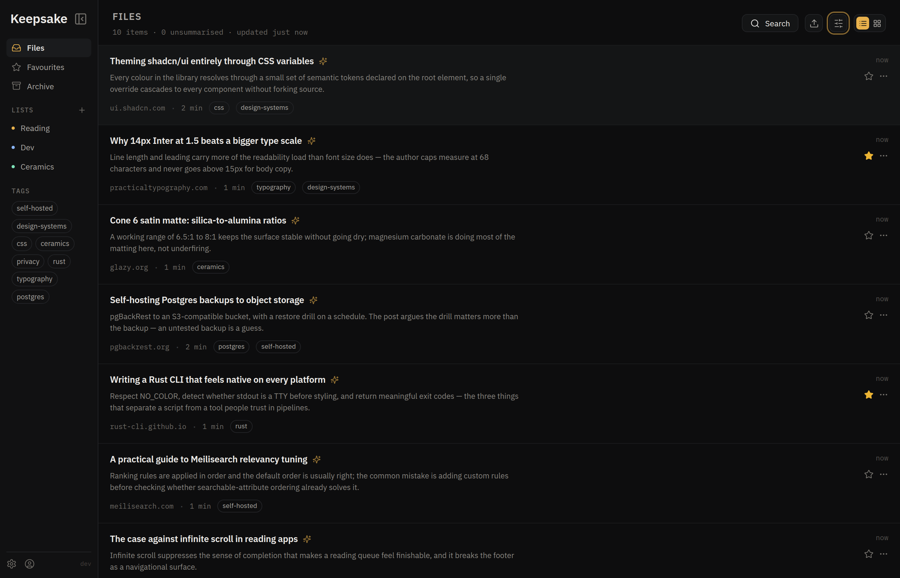
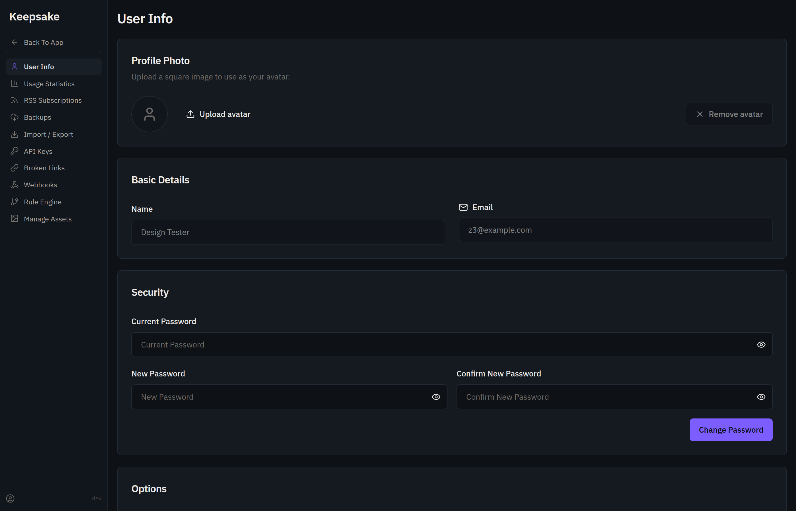
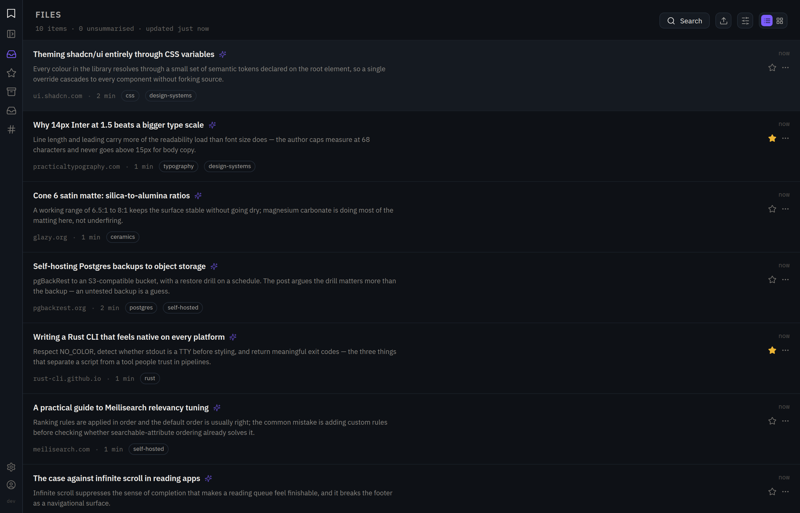
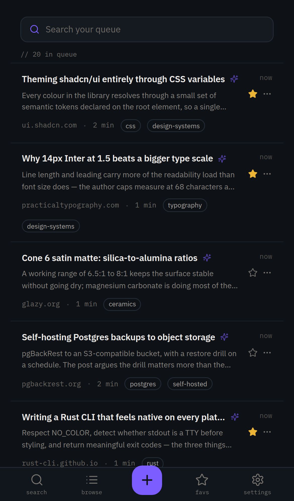

<div align="center">

# Keepsake

**A dense, keyboard-driven reading interface for [Karakeep](https://github.com/karakeep-app/karakeep).**

Same bookmarking engine. Different surface.

[](./LICENSE)
[](https://github.com/karakeep-app/karakeep)

</div>



## What this is

Keepsake is a **user-interface fork** of [Karakeep](https://github.com/karakeep-app/karakeep)
(previously Hoarder), the self-hostable bookmark-everything app.

Every capability that makes the app work — crawling, archiving, AI tagging and
summarisation, search, sync, the API, the mobile and browser clients — is
Karakeep's, built by [its authors](https://github.com/karakeep-app/karakeep/graphs/contributors).
This fork does not add features to that engine. It replaces the layer you look
at: a denser list, a reading-focused detail view, a runtime theme system, and a
consistent visual language across the dashboard and settings.

If you want the full-featured original, use
[Karakeep](https://github.com/karakeep-app/karakeep). If you spend a lot of time
in a long bookmark list and want it to read more like a reading queue, this fork
may suit you better.

## Screenshots

### Reading queue

Summary-first rows. Title, an AI summary when one exists, source, reading time
and tags — sized so more of the queue fits on screen at once.


### Detail read-out

Opens over the list. Where a summary is written as a list, it is split into a
lead paragraph and discrete key points rather than rendered as raw markdown.
The archived page stays collapsed underneath until asked for.



### Grid

The same data as cards, for when covers and scanning matter more than density.



### Themes

Four accents, three surface tones and three reading-emphasis levels, applied
live and remembered per browser. Below: amber on charcoal, versus the violet on
deep slate shown above.

<table>
<tr>
<td width="50%"></td>
<td width="50%"></td>
</tr>
</table>

### Settings, and the collapsed rail

Settings uses the same visual language as the dashboard rather than the stock
theme. The sidebar collapses to an icon rail when the list needs the width.

<table>
<tr>
<td width="50%"></td>
<td width="50%"></td>
</tr>
</table>

### Mobile

<div align="center">

</div>

## What this fork changes

| | |
|---|---|
| **Dense list & grid** | Reading-queue rows with summary, source, reading time and tags; grid as an alternative. Infinite scroll, sort, and a per-view toggle that persists. |
| **Detail read-out** | Purpose-built reading view replacing the stock preview. Parses list-style summaries into a lead and key points. Favourite, archive, tag, open original, re-summarise. |
| **Runtime theming** | 4 accents × 3 surface tones × 3 reading-emphasis levels, switchable live, persisted locally. Accent-tinted focus rings, text selection and list markers follow the choice. |
| **Consistent settings** | All settings pages and the profile menu use the fork's palette and typography. |
| **Display scale** | The UI fits itself to small viewports, with a manual scale control (85–250%) for anything else. |
| **Keyboard** | `⌘/Ctrl + E` opens quick add from anywhere; `⌘/Ctrl + K` jumps to search when a search backend is configured. |
| **Typography** | IBM Plex Sans and IBM Plex Mono, with mono reserved for metadata and labels. |

Dark-only, by design. The theme axes vary tone and accent, not light versus dark.

## What you get from Karakeep

Unchanged and inherited — see
[Karakeep's README](https://github.com/karakeep-app/karakeep#features) for the
full list:

Link, note, image and PDF bookmarking · automatic metadata and full-page
archival · AI tagging and summarisation (OpenAI or local models via Ollama) ·
full-text and semantic search · lists, nested lists and sharing · highlights ·
a rule engine · webhooks · RSS · OCR · REST API and CLI · browser extensions ·
iOS and Android apps · importers for Pocket, Linkwarden, Omnivore and others ·
SSO.

## Getting started

CI builds and publishes container images to `ghcr.io/hexpum/keepsake-ui` on
every push to `main` and on each tagged release (see
[`docker/docker-compose.yml`](./docker/docker-compose.yml) for the compose
file that pulls them). Until the first images land, or if you'd rather build
locally, use the from-source path below. To run upstream Karakeep itself with
its own prebuilt images instead of this fork's UI, follow
[Karakeep's installation docs](https://docs.karakeep.app/Installation/docker).

**Requirements:** Node 24 (see [`.nvmrc`](./.nvmrc)) and pnpm 11.

```bash
git clone https://github.com/HexPum/keepsake-ui.git
cd keepsake-ui
pnpm install
```

Create `.env` files for the web app and workers — at minimum a data directory
and an auth secret:

```bash
# apps/web/.env  and  apps/workers/.env
DATA_DIR=/absolute/path/to/data
NEXTAUTH_SECRET=$(openssl rand -base64 32)
```

Then run the two processes in separate terminals:

```bash
pnpm web       # http://localhost:3000
pnpm workers   # crawling, AI, indexing
```

Every configuration option Karakeep supports applies here too — see
[Karakeep's configuration reference](https://docs.karakeep.app/configuration).

### Optional: search

Search requires Meilisearch. A standalone compose file is included for local
development:

```bash
docker compose -f docker-compose.search.yml up -d
```

Add to **both** `apps/web/.env` and `apps/workers/.env`:

```bash
MEILI_ADDR=http://127.0.0.1:7700
MEILI_MASTER_KEY=<the key from docker-compose.search.yml>
```

Restart both processes, then backfill existing bookmarks from
**Admin → Background Jobs → Reindex**. Without a search backend the search
control stays visibly disabled rather than failing when clicked.

## Development

```bash
pnpm typecheck
pnpm lint
pnpm format:fix
pnpm --filter @karakeep/web test
```

The fork's own code lives in:

- `apps/web/components/dashboard/dense/` — list, grid, detail, sidebars, theme provider
- `apps/web/lib/dense/` — theming, scaling, summary parsing, formatting (unit-tested)
- `apps/web/app/dashboard/dense-theme.css` — design tokens and the shadcn variable remap
- `design/` — the source prototype and its handoff notes, vendored so values can be checked against it

## Roadmap

See [ROADMAP.md](./ROADMAP.md).

## Contributing

Issues and pull requests are welcome. Changes to the *engine* — crawling, AI,
API, data model — generally belong
[upstream in Karakeep](https://github.com/karakeep-app/karakeep), where they
benefit everyone and where this fork will pick them up on the next sync.
Interface and theming changes belong here.

Please run `pnpm typecheck`, `pnpm lint` and the web tests before opening a PR.

## Credits

Keepsake exists because Karakeep exists. It is the work of
[@MohamedBassem](https://github.com/MohamedBassem) and
[Karakeep's contributors](https://github.com/karakeep-app/karakeep/graphs/contributors),
and Karakeep is owned by [Localhost Labs Ltd](https://localhostlabs.co.uk).
If you find this useful, support the upstream project — star
[karakeep-app/karakeep](https://github.com/karakeep-app/karakeep), or use
[Karakeep Cloud](https://cloud.karakeep.app), which funds its development.

Not affiliated with or endorsed by Localhost Labs Ltd.

## License

[AGPL-3.0](./LICENSE), the same licence as upstream Karakeep. Modifications in
this fork are released under the same terms.
